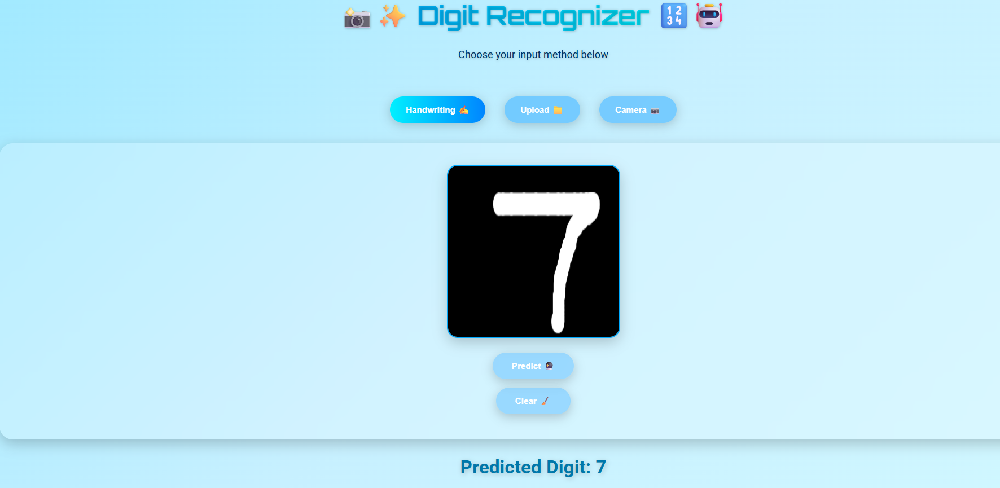

# 🔢 Digit Recognizer

An end-to-end **Convolutional Neural Network (CNN)** project that recognizes handwritten digits (0–9) using the **MNIST dataset**.  
The project includes **data preprocessing, model training, evaluation, and a Flask web application** with three input modes: handwriting canvas, image upload, and live camera capture.

---

## 📌 Introduction
This project demonstrates the full pipeline of building and deploying a digit recognition system:  
- Data loading, preprocessing, and augmentation.  
- Training a CNN with early stopping.  
- Model evaluation using accuracy, confusion matrix, and classification reports.  
- Deployment with Flask to provide a **web interface**.  
- Three input modes for predictions:
  - **Handwriting Canvas** ✍️  
  - **Image Upload** 📁  
  - **Live Camera Capture** 📷  

---

## ✅ Tasks Done
1. **Data Preparation**
   - Loaded MNIST dataset (from Kaggle Digit Recognizer).  
   - Normalized pixel values and reshaped inputs.  
   - One-hot encoded the labels.  
   - Created training & validation splits.  

2. **Exploratory Data Analysis (EDA)**
   - Visualized sample digits.  
   - Checked class distribution and pixel intensity distribution.  
   - PCA projection for dimensionality reduction.  

3. **Model Building**
   - CNN architecture with convolution, pooling, dropout, and dense layers.  
   - Compiled with `Adam` optimizer and categorical crossentropy loss.  
   - Used **early stopping** to prevent overfitting.  

4. **Training & Evaluation**
   - Applied data augmentation for better generalization.  
   - Trained CNN with accuracy and loss visualization.  
   - Evaluated with confusion matrix & classification report.  

5. **Deployment**
   - Built a **Flask backend** for predictions.  
   - Integrated frontend with:
     - **Canvas drawing for handwriting**.  
     - **File upload option**.  
     - **Camera capture mode**.  

---

## 🖥️ Flask App Screenshot

---

## 🎯 Conclusion
This project successfully demonstrates a **full end-to-end machine learning workflow** for digit recognition.  
From **data preprocessing** and **CNN training** to **real-time deployment with a web interface**, the system can accurately predict handwritten digits using multiple input methods.  
It showcases the integration of **deep learning and interactive web applications**, making the model accessible and user-friendly for practical usage.# CNN-Digit-Recognizer
